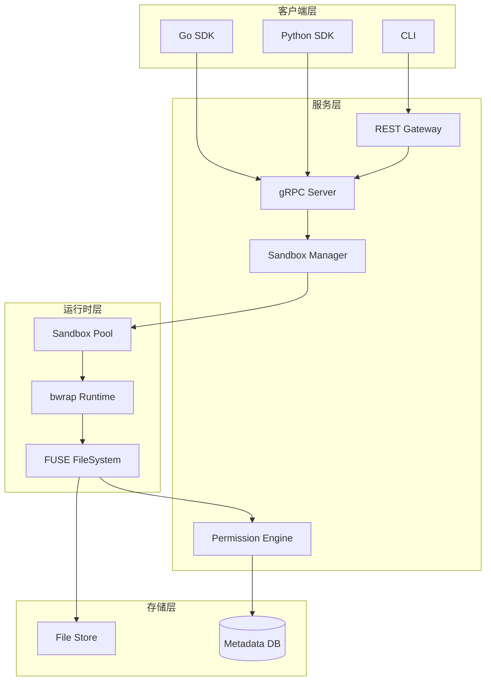
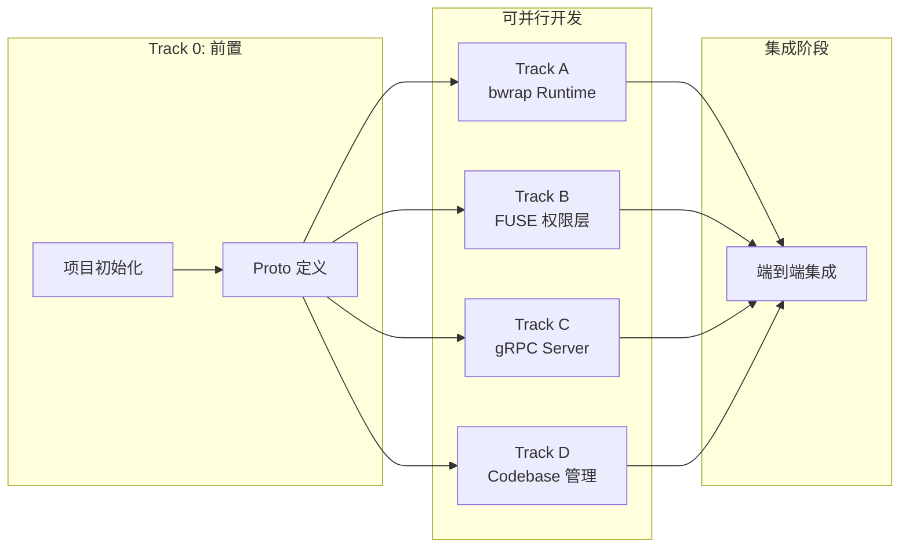

# Agent Sandbox 服务架构设计

## 1. 项目概述

### 1.1 核心定位

一个面向 AI Agent 的沙箱基础设施服务，解决市面上 Sandbox 产品缺乏的**细粒度文件权限控制**痛点。

### 1.2 核心特性

- **FUSE 权限控制**：支持 none/view/read/write 四级权限，glob 模式 + 目录级别 + 单文件优先级覆盖
- **轻量级隔离**：基于 bwrap (bubblewrap) 实现毫秒级启动的进程隔离
- **Runtime 抽象层**：为后续迁移到 Docker/gVisor 预留扩展性
- **多 Sandbox 共享 Codebase**：同一文件夹可被多个 Agent 以不同权限访问

### 1.3 使用场景

- 对话式 Agent（类似 Cursor 的交互操作）
- 定时触发 Agent（Schedule 触发的批处理任务）
- 常驻 API 服务（Sandbox 长期运行，通过 API 分发）

---

## 2. 系统架构



---

## 3. 核心组件设计

### 3.1 权限模型

四级权限层次：

- `none`: 完全不可见，ls 也看不到
- `view`: 可以 ls 看到文件名，但不能读取内容
- `read`: 可以查看和读取内容
- `write`: 可以修改文件

权限配置优先级：单文件 > 目录 > glob 模式

### 3.2 数据模型

**Sandbox**

```go
type Sandbox struct {
    ID          string
    CodebaseID  string            // 关联的 Codebase
    Permissions []PermissionRule  // 独立的权限配置
    Status      SandboxStatus     // pending/running/stopped/error
    PID         int               // bwrap 进程 PID
    MountPoint  string            // FUSE 挂载点
}
```

**PermissionRule**

```go
type PermissionRule struct {
    Pattern    string      // "/docs/**", "*.md", "/config.yaml"
    Type       PatternType // glob/directory/file
    Permission Permission  // none/view/read/write
    Priority   int
}
```

**Codebase**

```go
type Codebase struct {
    ID        string
    Name      string
    Path      string  // 实际存储路径
    OwnerID   string
}
```

### 3.3 Runtime 抽象层

```go
type SandboxRuntime interface {
    Create(ctx context.Context, config *SandboxConfig) (*Sandbox, error)
    Start(ctx context.Context, id string) error
    Exec(ctx context.Context, id string, cmd *ExecRequest) (*ExecResult, error)
    Stop(ctx context.Context, id string) error
    Destroy(ctx context.Context, id string) error
}
```

初期实现 `BwrapRuntime`，后续可添加 `DockerRuntime`。

---

## 4. 关键接口设计

### 4.1 gRPC 服务定义

```protobuf
service SandboxService {
    rpc CreateSandbox(CreateSandboxRequest) returns (Sandbox);
    rpc StartSandbox(StartSandboxRequest) returns (Sandbox);
    rpc StopSandbox(StopSandboxRequest) returns (Sandbox);
    rpc DestroySandbox(DestroySandboxRequest) returns (Empty);
    rpc GetSandbox(GetSandboxRequest) returns (Sandbox);
    
    rpc Exec(ExecRequest) returns (ExecResult);
    rpc ExecStream(ExecRequest) returns (stream ExecOutput);
}

service CodebaseService {
    rpc CreateCodebase(CreateCodebaseRequest) returns (Codebase);
    rpc UploadFiles(stream UploadChunk) returns (UploadResult);
    rpc GetCodebase(GetCodebaseRequest) returns (Codebase);
}
```

### 4.2 Python SDK 示例

```python
from sandbox_sdk import SandboxClient

client = SandboxClient(endpoint="localhost:9000")

sandbox = client.create_sandbox(
    codebase_id="cb_123",
    permissions=[
        {"pattern": "/docs/**", "permission": "write"},
        {"pattern": "**/*.py", "permission": "read"},
    ]
)
client.start_sandbox(sandbox.id)

result = client.exec(sandbox.id, command="ls -la /workspace")
print(result.stdout)
```

---

## 5. 技术选型

| 组件 | 选型 | 理由 |

|------|------|------|

| 隔离技术 | bwrap | 毫秒级启动，轻量级 |

| 权限控制 | FUSE (go-fuse) | 灵活支持动态权限配置 |

| API 协议 | gRPC + grpc-gateway | 高性能 + REST 兼容 |

| 元数据存储 | SQLite (初期) | 简单，单机足够 |

| 开发语言 | Go | 适合系统编程 |

---

## 6. 项目结构

```
sandbox-rls/
├── api/proto/           # Protobuf 定义
├── cmd/                 # 可执行入口
│   ├── sandbox-server/
│   └── sandbox-cli/
├── internal/
│   ├── server/          # gRPC + REST 服务
│   ├── sandbox/         # 核心业务逻辑
│   ├── runtime/         # Runtime 抽象层
│   │   ├── bwrap/
│   │   └── docker/      # 预留
│   ├── fs/              # FUSE 文件系统
│   └── codebase/        # Codebase 管理
├── sdk/
│   ├── go/
│   └── python/
└── configs/
```

---

## 7. 关键设计决策

| 决策点 | 选择 | 理由 |

|--------|------|------|

| 隔离技术 | bwrap 优先 | 启动快，简单场景足够 |

| 权限实现 | FUSE | 支持 glob、动态配置、自定义错误 |

| 并发冲突 | Last-write-wins | 初版简化，后续可扩展乐观锁 |

| API 生命周期 | Create/Start 分离 | 为 Docker 迁移预留 |

| SDK 协议 | gRPC 为主 | 流式输出、类型安全 |

---

## 8. TDD 开发流程

每个功能模块遵循 TDD 循环：

```
┌─────────────────────────────────────────────────────────────┐
│  1. RED: 编写失败的测试                                      │
│     └── 定义期望的接口行为                                   │
│                    ↓                                        │
│  2. GREEN: 编写最小实现使测试通过                            │
│     └── 只写足够让测试通过的代码                             │
│                    ↓                                        │
│  3. REFACTOR: 重构代码                                      │
│     └── 保持测试通过的前提下优化代码                         │
└─────────────────────────────────────────────────────────────┘
```

测试目录结构：

```
sandbox-rls/
├── internal/
│   ├── runtime/
│   │   ├── runtime.go          # 接口定义
│   │   ├── bwrap/
│   │   │   ├── bwrap.go
│   │   │   └── bwrap_test.go   # 单元测试
│   │   └── runtime_test.go     # 接口契约测试
│   ├── fs/
│   │   ├── permission.go
│   │   ├── permission_test.go
│   │   ├── fuse.go
│   │   └── fuse_test.go
│   └── ...
├── test/
│   ├── integration/            # 集成测试
│   │   └── sandbox_test.go
│   └── e2e/                    # 端到端测试
│       └── full_flow_test.go
```

---

## 9. 并行开发 Track 规划

### 依赖关系图



### Track 详细说明

#### Track 0: 项目初始化 (前置，需先完成)

- 负责人：1 个 Agent
- 产出：`go.mod`, 目录结构, `pkg/types/`, `api/proto/*.proto`
- 预计工作量：较小

#### Track A: bwrap Runtime (可并行)

- 负责人：1 个 Agent
- 职责：进程隔离、Sandbox 生命周期管理
- 文件范围：`internal/runtime/`
- 依赖：`pkg/types/`
- TDD 顺序：

  1. 编写 `runtime_test.go` (接口契约测试)
  2. 实现 `bwrap/bwrap.go`
  3. 编写 `executor_test.go`
  4. 实现 `executor.go`

#### Track B: FUSE 权限层 (可并行)

- 负责人：1 个 Agent
- 职责：文件权限控制、FUSE 挂载
- 文件范围：`internal/fs/`
- 依赖：`pkg/types/`
- TDD 顺序：

  1. 编写 `permission_test.go` (权限匹配逻辑)
  2. 实现 `permission.go`
  3. 编写 `fuse_test.go` (文件操作拦截)
  4. 实现 `fuse.go`

#### Track C: gRPC Server (可并行)

- 负责人：1 个 Agent
- 职责：API 层实现
- 文件范围：`internal/server/`, `api/proto/`
- 依赖：Proto 定义
- TDD 顺序：

  1. 生成 gRPC 代码
  2. 编写 `server_test.go` (mock 依赖)
  3. 实现 handlers

#### Track D: Codebase 管理 (可并行)

- 负责人：1 个 Agent
- 职责：用户文件夹管理
- 文件范围：`internal/codebase/`
- 依赖：`pkg/types/`
- TDD 顺序：

  1. 编写 `store_test.go`
  2. 实现 `store.go`
  3. 编写 `manager_test.go`
  4. 实现 `manager.go`

### 并行开发注意事项

1. **接口先行**：各 Track 之间通过接口交互，先定义接口再实现
2. **Mock 依赖**：测试时使用 mock 替代其他 Track 的实现
3. **避免冲突**：每个 Track 只修改自己范围内的文件
4. **定期同步**：完成一个子任务后及时 commit，避免合并冲突

### 推荐的 Agent 分配

| Agent | 负责 Track | 启动条件 |

|-------|-----------|---------|

| Agent 1 | Track 0 (初始化) | 立即开始 |

| Agent 2 | Track A (bwrap) | Track 0 完成后 |

| Agent 3 | Track B (FUSE) | Track 0 完成后 |

| Agent 4 | Track C (gRPC) | Track 0 完成后 |

| Agent 5 | Track D (Codebase) | Track 0 完成后 |

或者 3 个 Agent 的分配：

| Agent | 负责 Track |

|-------|-----------|

| Agent 1 | Track 0 → Track A |

| Agent 2 | Track B |

| Agent 3 | Track C + Track D |

---

## 10. 非目标（初版不做）

- 分布式部署
- 乐观锁冲突检测
- Docker/gVisor Runtime
- 网络策略配置
- 资源配额限制